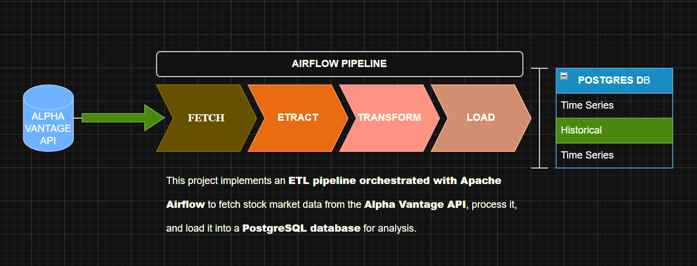
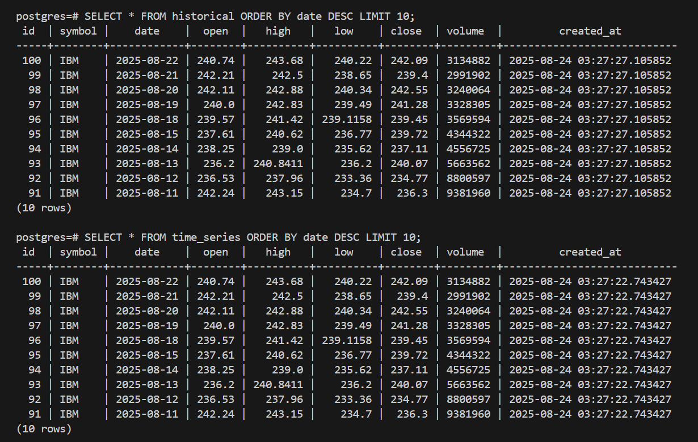

# 📊 Airflow ETL Pipeline for Stock Market Data  

This project is an **ETL pipeline built with Apache Airflow** that fetches real-time and historical stock market data from the **Alpha Vantage API**, transforms it, and loads it into a **PostgreSQL database** for analysis and reporting.  

---

## 🚀 Pipeline Architecture  

The workflow follows the standard **Extract → Transform → Load (ETL)** process:  

1. **Extract** – Data is fetched from the Alpha Vantage API.  
2. **Transform** – Data is cleaned, normalized, and structured for database insertion.  
3. **Load** – Final data is stored in PostgreSQL tables.  

  

---

## ⚙️ Features  
- Automated stock data ingestion from Alpha Vantage.  
- Task scheduling and orchestration with **Apache Airflow**.  
- PostgreSQL integration for structured storage.  
- Modular DAG design for scalability.  
- Easy visualization and monitoring via Airflow UI.  

---

## 🗄️ Database Tables  

The pipeline creates a `time_series` table in PostgreSQL to store historical stock data.  

Example schema and sample rows:  

  

---

## 📂 Project Structure  

